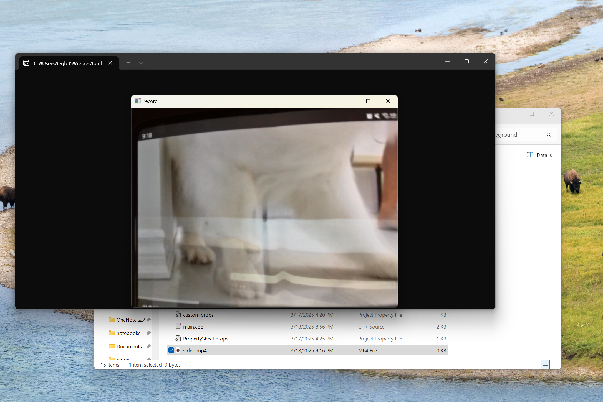

# cv_video_recorder
Computer Vision HW 1

- c++ 버전 opencv로 작성한 간단한 비디오 레코더.
    - (컴파일된 프로그램명) (비디오 파일 이름.mp4) 처럼 사용함 ex) $>recorder video.mp4
    - 0번 카메라로 들어오는 비디오 스트림을 저장
    - space 키를 누를경우 녹화 시작(동시에 왼쪽위 빨간점으로 표시), 다시 space를 누를경우 녹화가 이어서 진행됨
    - esc 키를 누르면 프로그램이 종료됨과 동시에 녹화된 프레임이 같은 폴더내에 영상(H264)으로 저장됨
    - F 키를 누르면 화면이 좌우 반전됨
    - 단, 한 번만 저장할 수 있음
